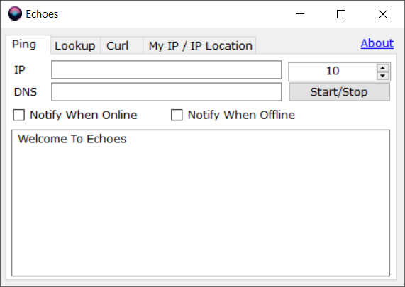

🚀 Echoes (inspired by Pink Floyd’s album)
A multi-functional Windows networking utility built with C# (.NET Framework 4.7.2).
Entirely developed with AI assistance — optimized for performance, simplicity, and practical use.

✨ Features
🛰 #Ping Utility
Supports single IP, hostname, and IP ranges

Live detection and auto-start on valid input

Custom DNS resolver support

Configurable ping delay (default: 1s)

Modes:

🔁 Continuous Online Ping: notifies on first success

❌ Offline Ping Monitor: alerts on consecutive failures

Real-time logging with timestamps and auto-scroll

DNS resolution happens once before ping starts

🔍 #DNS Lookup
Lookup any domain with custom DNS servers (multi-line input)

Supports multiple record types (A, MX, TXT, etc.)

Performed for all selected DNS resolvers

Logs individual responses in a unified log box

🌐 #Curl-like Web Request
Send HTTP GET requests to any URL

Supports:

Custom IP override (via Host header)

Proxy configuration

SSL ignore switch

Response shows full headers and body, neatly formatted

🧠 #IP Information Utility
Fetch your public IP using reliable APIs (ipify, icanhazip, etc.)

Lookup geolocation and data center info of any IP via APIs (ipapi, ipinfo, etc.)

🤖 AI-Assisted Development
This project was entirely created with the help of OpenAI's ChatGPT, from feature brainstorming, to architecture design, to writing production-ready code and UI.

