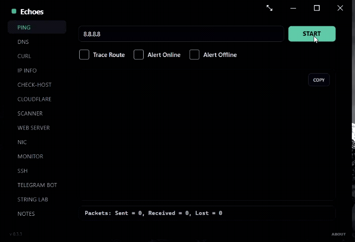

# Echoes 🛰️ — Cross-Platform Network & Developer Toolkit

> A free, open-source network and developer toolkit for **Windows, macOS, Linux, and Android** — ping, port scanner, SSH, DNS/WHOIS, cURL, Cloudflare DNS, IP/GeoIP, a built-in file/web server, global host checks, service monitor, encrypted notes & backup, and string/JSON tools, all in one app.

[GitHub Repository](https://github.com/SinaXhpm/Echoes) | [Telegram](https://t.me/the_pink_palace)

  

## About

**Echoes** is a single desktop and mobile app that bundles the network and developer utilities you reach for every day — pinging hosts, scanning ports, connecting over SSH, looking up DNS/WHOIS and IP/GeoIP data, sending HTTP requests, managing Cloudflare DNS, serving files over a built-in web server, checking a host from servers around the world, monitoring uptime, keeping encrypted notes and backups, and transforming text/JSON. It runs on Windows, macOS, Linux, and Android from one codebase, works offline, and stores your data locally (no accounts, no telemetry). The desktop builds are zero-dependency Native AOT binaries — nothing to install.

## Install

Download the file for your platform from the **[Releases](https://github.com/SinaXhpm/Echoes/releases)** page:

| Platform | File | How to install |
| :--- | :--- | :--- |
| **Windows** | `.zip` | Extract and run `Echoes.exe` |
| **macOS** | `.dmg` | Open it and drag `Echoes.app` to Applications |
| **Linux** | `.AppImage` | `chmod +x` then run |
| **Debian/Ubuntu** | `.deb` | `sudo dpkg -i echoes.deb` |
| **Android** | `.apk` | Allow "install from unknown sources", then open the APK (needs Android 6.0+) |

The desktop builds are self-contained (Native AOT) — no .NET runtime needed.

## Features

### Network
- **Ping & Traceroute** — live ICMP ping with packet-loss stats and hop-by-hop tracing.
- **Port Scanner** — TCP/UDP scan for single IPs, ranges, and CIDR; export to CSV.
- **SSH Terminal** — terminal with ANSI colors, command history, and SOCKS5 proxy/tunneling.
- **DNS & WHOIS** — query DNS records (A, AAAA, MX, TXT, …) via custom resolvers with a multi-select type picker, plus RDAP domain lookups; paste a full URL and it extracts the host automatically.
- **Host Checker** — check a host from servers around the world (via check-host.net): **ping / HTTP / TCP / DNS** from multiple global nodes at once, with per-node latency, status, and country flag, plus an optional proxy.
- **NIC Explorer** — network adapters with IPv4/IPv6, MAC, and status (desktop only).

### Web & API
- **cURL Client** — a GUI for HTTP requests with HTTP/SOCKS proxy, IP override, and full logging, plus a built-in web view to preview the response.
- **Web Server** — share files and folders over HTTP with any device on your network in one click. Comes with a branded landing page, live stats (active connections, total downloads, bytes sent, unique clients), per-file counters, and copy/QR share links. A pure managed server — no external dependency, works on desktop and Android.
- **Cloudflare DNS Manager** — manage a domain's DNS straight from the app: list zones and add / edit / delete records (A, AAAA, CNAME, MX, TXT, …), toggle proxied vs DNS-only, and set TTL. Authenticate with an API Token or Global API Key + email, keep several named connection profiles (each with its own proxy), all locked behind a master password in an encrypted vault.
- **Telegram Bot Tester** — call Bot API methods and see the raw verbose response.
- **SSL Inspector** — read a site's TLS certificate (subject, issuer, validity, key, chain).
- **IP Info** — your public IP plus GeoIP lookup for any address, cross-checked across several providers (ip-api, ipwho.is, ipapi.co) with per-provider results, a provider selector (default Auto), country flags, and a map link; SOCKS5/HTTP proxy supported.
- **Service Monitor** — watch a list of hosts/URLs with per-target **Ping / TCP / HTTP** checks, a configurable interval and timeout, live uptime + failure counters, and an optional sound alert when a target goes up or down.

### Tools
- **Encrypted Notes** — local notes encrypted with AES-256 + a master key. The key is never stored; if you lose it, the notes can't be recovered.
- **Encrypted Backup** — export everything (profiles, settings, and notes) to one password-protected file (PBKDF2 + AES-256-GCM) and restore it on another machine. Fully offline — no account, no cloud.
- **Input History** — the History tab remembers recent hosts, targets, and URLs per tool so you can re-run them in a click.
- **String Lab** — a developer text/data toolbox in one tab:
  - **Encode / decode** — Base64 and URL.
  - **Hashing** — MD5 / SHA-256, plus a **hash identifier** that guesses a hash's type (bcrypt, Argon2, MD5, SHA-family, NTLM, CRC, JWT, …) from its shape.
  - **Regex** — test a pattern with a capture-group breakdown or run replace, backed by a library of ready-made extractors (IPv4/IPv6, domains, URLs, emails, MAC, JWT, GUID, dates, …).
  - **JSON** — format / minify, and convert **JSON ↔ YAML** and **JSON ↔ CSV**.
  - **Subnet calculator** — expand a CIDR into network, broadcast, host range, usable count, and mask.
  - **Epoch converter** — Unix timestamps (sec / ms / µs) ↔ UTC / local / ISO 8601 / RFC 1123, with a relative "… ago" line.
  - **Base converter** — decimal / hex / binary / octal, auto-detecting `0x` / `0b` / `0o` input.
  - **Text diff** — compare two blocks of text line by line.
  - **Case & cleanup** — case conversion and whitespace/text tidy-up.
  - **Generators** — UUID / GUID, secure password, alphanumeric, hex, Base64, and PIN, using a cryptographic RNG.

## Android notes

The Android app runs the same UI, adapted for touch: a drawer-based layout that reflows to fit phone screens. Long-running tools (**Service Monitor** and **Port Scanner**) keep running when the app is in the background via a foreground service, so a scan or uptime check isn't cut off when you switch away.

A few desktop features don't work inside the Android sandbox: the real `curl` engine (the built-in .NET engine is the default there instead), notification sounds, and NIC Explorer. Everything else — ping, SSH, DNS, host checker, IP info, scanner, monitor, cURL via .NET, and the file/web server — works.

## FAQ

**What is Echoes?**
A free, open-source, all-in-one network and developer toolkit (ping, port scanner, SSH, DNS, host checker, cURL, web server, Cloudflare DNS, IP info, uptime monitor, encrypted notes, string/JSON tools) for Windows, macOS, Linux, and Android.

**Is it free and open source?**
Yes — MIT licensed and free to use.

**Which platforms are supported?**
Windows, macOS, Linux, and Android. One app, one codebase.

**Do I need to install .NET or any runtime?**
No. The desktop versions are self-contained Native AOT binaries. Just download and run.

**Does it collect data or need an account?**
No. It runs locally, has no telemetry, and notes are encrypted on your device.

**Is it a good alternative to using separate ping/nmap/ssh/curl tools?**
It puts the common everyday tasks of those tools into one cross-platform GUI. For deep, specialized work the dedicated CLIs still go further.

## Built with

- **Avalonia UI** + **.NET 8** (Android head on .NET 10).
- **Native AOT** on desktop for fast startup and low memory use.
- Developed with AI assistance. Named after *"Echoes"* by Pink Floyd.

## Note

Primary development and testing is on **Windows**. macOS, Linux, and Android builds may have minor rough edges.

## License

MIT.

---

**Keywords:** network toolkit, network utility, network scanner, ping tool, traceroute, port scanner, TCP/UDP scanner, SSH client, SSH terminal, DNS lookup, WHOIS, host checker, check-host, global ping, multi-node check, cURL GUI, HTTP client, web server, HTTP file server, LAN file sharing, Cloudflare DNS manager, DNS record editor, IP lookup, GeoIP, public IP, uptime monitor, latency monitor, SSL/TLS certificate inspector, encrypted notes, encrypted backup, AES-256, Base64, regex tester, JSON formatter, JSON to YAML, JSON to CSV, hashing tool, hash identifier, subnet calculator, CIDR calculator, epoch converter, unix timestamp converter, base converter, text diff, password generator, UUID generator, cross-platform, Windows, macOS, Linux, Android, Avalonia UI, .NET, Native AOT, open source, free.
