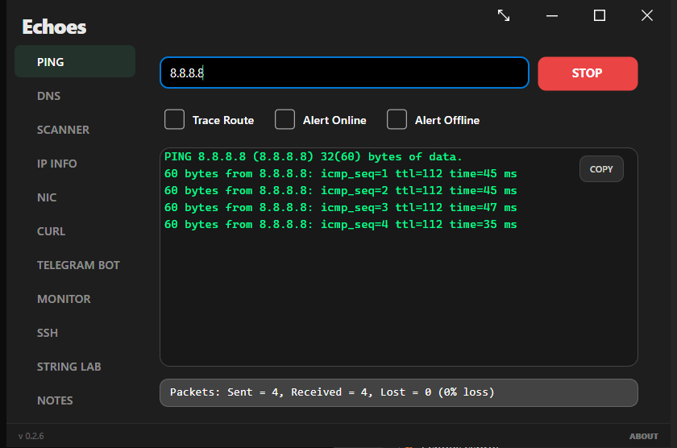
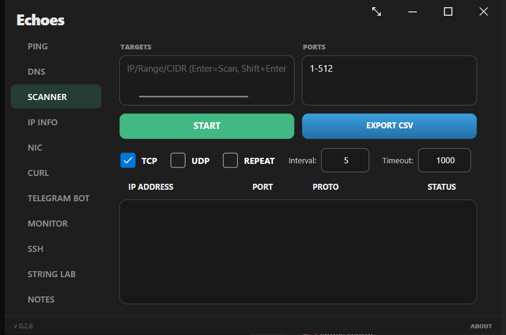
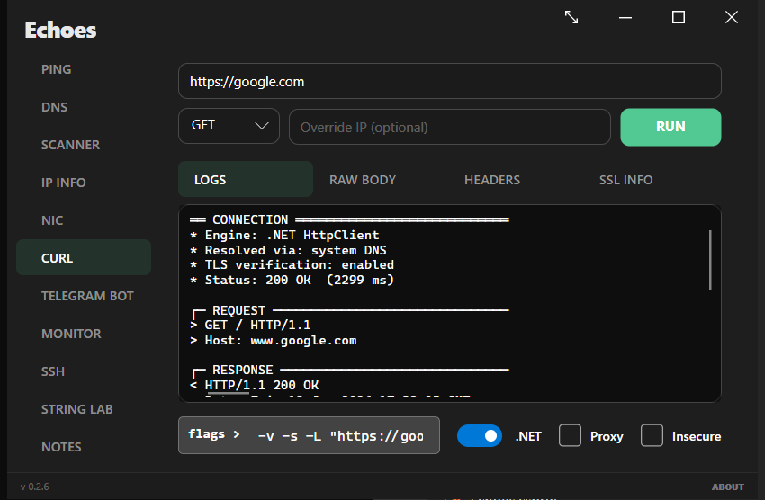
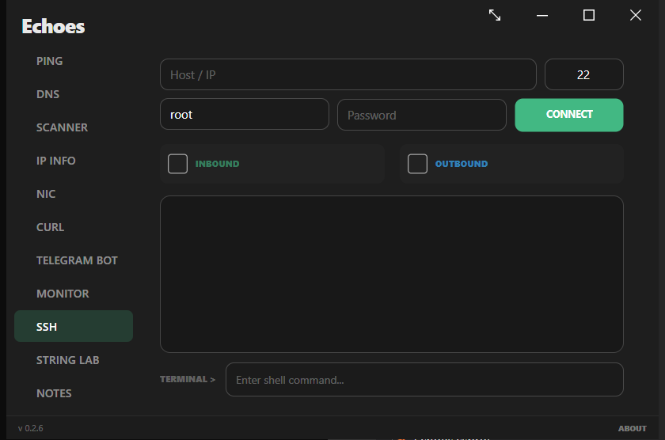
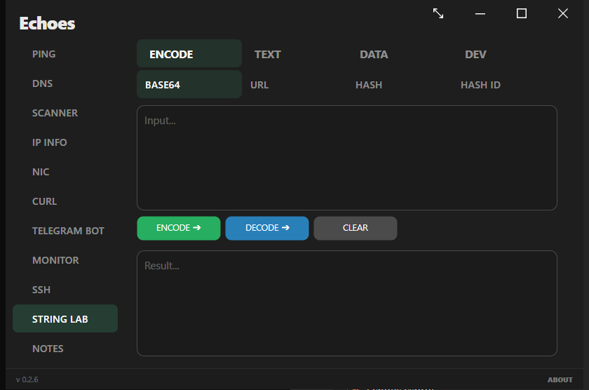

# Echoes 🛰️ — Cross-Platform Network & Developer Toolkit

> A free, open-source network and developer toolkit for **Windows, macOS, Linux, and Android** — ping, port scanner, SSH, DNS/WHOIS, cURL, IP/GeoIP, service monitor, encrypted notes, and string/JSON tools, all in one app.

[GitHub Repository](https://github.com/SinaXhpm/Echoes) | [Telegram](https://t.me/the_pink_palace)

## About

**Echoes** is a single desktop and mobile app that bundles the network and developer utilities you reach for every day — pinging hosts, scanning ports, connecting over SSH, looking up DNS/WHOIS and IP/GeoIP data, sending HTTP requests, monitoring uptime, keeping encrypted notes, and transforming text/JSON. It runs on Windows, macOS, Linux, and Android from one codebase, works offline, and stores your data locally (no accounts, no telemetry). The desktop builds are zero-dependency Native AOT binaries — nothing to install.

## Screenshots

| | |
| :---: | :---: |
|  **Port Scanner** — TCP/UDP, IP ranges & CIDR |  **cURL Client** — HTTP requests with full logging |
|  **SSH Terminal** — ANSI colors + SOCKS proxy |  **String Lab** — encode, hash, regex, JSON |

## Install

Download the file for your platform from the **[Releases](https://github.com/SinaXhpm/Echoes/releases)** page:

| Platform | File | How to install |
| :--- | :--- | :--- |
| **Windows** | `.zip` | Extract and run `Echoes.exe` |
| **macOS** | `.dmg` | Open it and drag `Echoes.app` to Applications |
| **Linux** | `.AppImage` | `chmod +x` then run |
| **Debian/Ubuntu** | `.deb` | `sudo dpkg -i echoes.deb` |
| **Android** | `.apk` | Allow "install from unknown sources", then open the APK (needs Android 6.0+) |

The desktop builds are self-contained (Native AOT) — no .NET runtime needed.

## Features

### Network
- **Ping & Traceroute** — live ICMP ping with packet-loss stats and hop-by-hop tracing.
- **Port Scanner** — TCP/UDP scan for single IPs, ranges, and CIDR; export to CSV.
- **SSH Terminal** — terminal with ANSI colors, command history, and SOCKS5 proxy/tunneling.
- **DNS & WHOIS** — query DNS records (A, MX, TXT, …) via custom resolvers, plus RDAP domain lookups.
- **NIC Explorer** — network adapters with IPv4/IPv6, MAC, and status (desktop only).

### Web & API
- **cURL Client** — a GUI for HTTP requests with HTTP/SOCKS proxy, IP override, and full logging.
- **Telegram Bot Tester** — call Bot API methods and see the raw verbose response.
- **SSL Inspector** — read a site's TLS certificate (subject, issuer, validity, key, chain).
- **IP Info** — your public IP and GeoIP lookup, with SOCKS5/HTTP proxy support.
- **Service Monitor** — track uptime and latency for a list of hosts/URLs.

### Tools
- **Encrypted Notes** — local notes encrypted with AES-256 + a master key. The key is never stored; if you lose it, the notes can't be recovered.
- **String Lab** — Base64/URL encoding, hashing (MD5/SHA256), regex testing, JSON format/minify, case conversion, text cleanup, and token generators.

## Android notes

The Android app runs the same UI. A few desktop features don't work inside the Android sandbox: the real `curl` engine (use the built-in .NET engine instead), notification sounds, and NIC Explorer. Everything else (ping, SSH, DNS, IP info, scanner, monitor, cURL via .NET) works.

## FAQ

**What is Echoes?**
A free, open-source, all-in-one network and developer toolkit (ping, port scanner, SSH, DNS, cURL, IP info, uptime monitor, encrypted notes, string/JSON tools) for Windows, macOS, Linux, and Android.

**Is it free and open source?**
Yes — MIT licensed and free to use.

**Which platforms are supported?**
Windows, macOS, Linux, and Android. One app, one codebase.

**Do I need to install .NET or any runtime?**
No. The desktop versions are self-contained Native AOT binaries. Just download and run.

**Does it collect data or need an account?**
No. It runs locally, has no telemetry, and notes are encrypted on your device.

**Is it a good alternative to using separate ping/nmap/ssh/curl tools?**
It puts the common everyday tasks of those tools into one cross-platform GUI. For deep, specialized work the dedicated CLIs still go further.

## Built with

- **Avalonia UI** + **.NET 8** (Android head on .NET 10).
- **Native AOT** on desktop for fast startup and low memory use.
- Developed with AI assistance. Named after *"Echoes"* by Pink Floyd.

## Note

Primary development and testing is on **Windows**. macOS, Linux, and Android builds may have minor rough edges.

## License

MIT.

---

**Keywords:** network toolkit, network utility, network scanner, ping tool, traceroute, port scanner, TCP/UDP scanner, SSH client, SSH terminal, DNS lookup, WHOIS, cURL GUI, HTTP client, IP lookup, GeoIP, public IP, uptime monitor, latency monitor, SSL/TLS certificate inspector, encrypted notes, AES-256, Base64, regex tester, JSON formatter, hashing tool, cross-platform, Windows, macOS, Linux, Android, Avalonia UI, .NET, Native AOT, open source, free.
